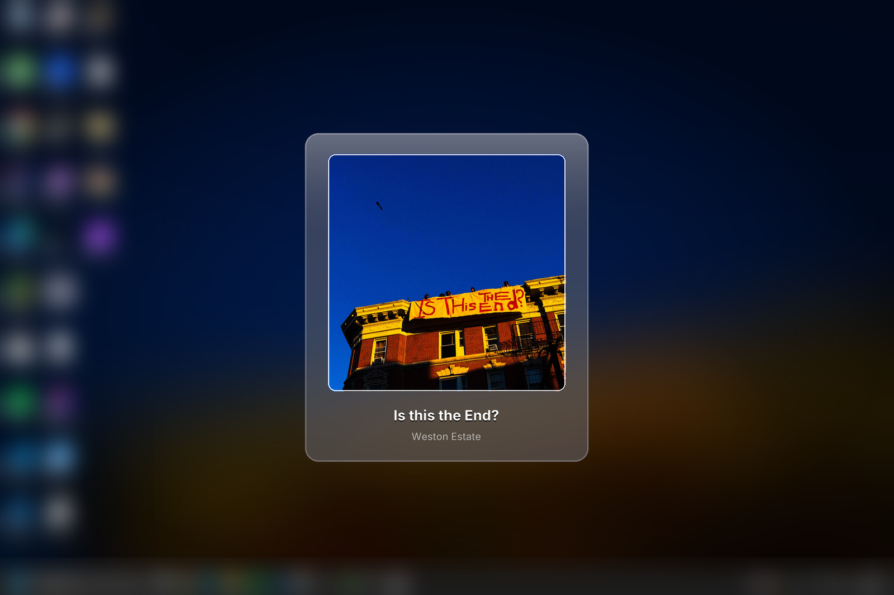
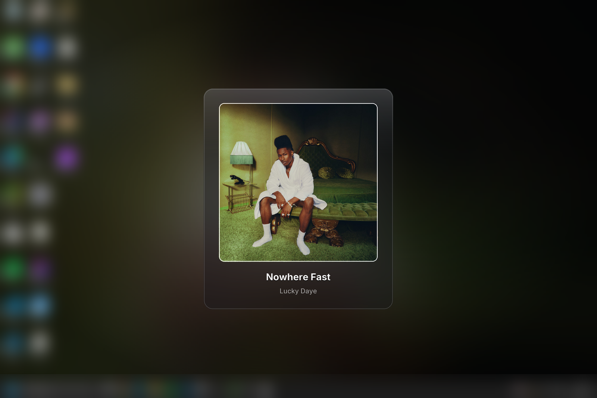

# nowPlayingDesktops

[](https://github.com/hippi345/nowPlayingDesktops/actions/workflows/ci.yml)
[](LICENSE)

Set your desktop wallpaper to the album art of whatever you are playing on Spotify (or another supported desktop player in **local** mode).

## Screenshots

<p>
  
  
</p>

## Which mode should I pick?

| Mode | Command | What it needs | Players / devices | Account / app setup | Pros | Cons |
|------|---------|---------------|-------------------|----------------------|------|------|
| **Local** | `--source local` | Python 3.12+, OS extras below, media app **playing on this computer** | Spotify desktop (Windows SMTC, Linux MPRIS, macOS AppleScript); other MPRIS players on Linux may work if they expose metadata | None | No Spotify Developer app; no OAuth; playback detection works offline | Art is often a small system thumbnail unless [online art](#album-art-in-local-mode) is enabled; desktop app must be on this machine |
| **Spotify** | `--source spotify` | Same Python install + `SPOTIPY_CLIENT_ID` in `.env` | Any device where **your** Spotify account is playing (phone, web, desktop, etc.) | [Spotify Developer](https://developer.spotify.com/dashboard) app; PKCE `login` once; Development mode **user allowlist** (up to 5 users) | High-resolution album art from the Web API | Requires Spotify credentials and allowlisted users in dev mode |
| **Auto** | omit `--source`, or `--source auto`, or `NOW_PLAYING_SOURCE=auto` (default) | Resolves to Spotify or local using the rules below | Same as the **effective** mode | Same as the effective mode | One command whether or not you use the Web API | Surprising if you expected local but have `SPOTIPY_CLIENT_ID` set |

**How `auto` resolves** (see `resolve_effective_playback_source` in `playback_source.py`):

1. `--source spotify` or `NOW_PLAYING_SOURCE=spotify` → **Spotify** Web API.
2. `--source local` or `NOW_PLAYING_SOURCE=local` → **local** OS media session.
3. Otherwise (`auto`): if `SPOTIPY_CLIENT_ID` is set and non-empty in the environment (after `.env` load), effective mode is **Spotify**; if not, **local**.

A resolved Spotify run still needs a username (`SPOTIPY_CLIENT_USERNAME` or a `run`/`login` argument) and a usable token cache from `now-playing login` (or legacy client-secret flow). **Online art** (iTunes Search lookups and Spotify art URL downloads) applies to **local** mode by default; see [Album art in local mode](#album-art-in-local-mode).

Legacy console scripts `now-playing-macos` and `now-playing-windows` behave like `now-playing run …` when you omit the `run` subcommand.

---

## Quick Start: Local mode

Local mode reads playback from the OS media session on **this** machine. Pick your OS:

### Windows (local)

**Prerequisites**

- **Python 3.12+** (`requires-python` in `pyproject.toml`; CI tests 3.12 and 3.13).
- **Install:** `pip install -e ".[windows]"` (WinRT optional deps for SMTC).
- **Player:** Spotify **desktop** app playing on this PC (System Media Transport Controls).

**Run**

```powershell
python -m venv .venv
.\.venv\Scripts\Activate.ps1
pip install -e ".[windows]"
now-playing run --source local
```

**Nice extra:** When the lock screen is set to use the **same picture as the desktop wallpaper**, the composed tile can appear on the lock screen while a track is playing; it is restored when you pause (same restore path as the desktop).

### Linux (local)

**Prerequisites**

- **Python 3.12+**
- **Install:** `pip install -e ".[linux]"` (`dbus-next` for MPRIS).
- **D-Bus session:** `echo $DBUS_SESSION_BUS_ADDRESS` should be set in your desktop session.
- **Player:** Spotify desktop or another app with **MPRIS** (`org.mpris.MediaPlayer2.*`). `playerctl` is not required by this app.
- **Wallpaper backend** (one of): GNOME family — `gsettings`; KDE — `plasma-apply-wallpaperimage` and/or `qdbus6` / `qdbus`; other WMs — `feh`, `swaybg`, or `nitrogen` (plus `xrandr` or `wlr-randr` for screen size).

**Run**

```bash
python3.12 -m venv .venv
source .venv/bin/activate
pip install -e ".[linux]"
now-playing run --source local
```

### macOS (local)

**Prerequisites**

- **Python 3.12+**
- **Install:** `pip install -e ".[macos]"` (`appscript` for Spotify AppleScript control).
- **Player:** **Spotify.app** playing on this Mac.
- **Automation:** macOS may prompt for **Automation** permission for your terminal or Python to control Spotify (System Settings → Privacy & Security → Automation).

**Run**

```bash
python3.12 -m venv .venv
source .venv/bin/activate
pip install -e ".[macos]"
now-playing run --source local
```

Optional PyObjC (`pyobjc-framework-Cocoa`) improves per-display wallpaper control; without it, `osascript` sets all screens.

### Common `run` flags (local)

- `-v` / `--verbose` — debug logging
- `--once` — single poll/apply cycle
- `--env-file PATH` — load settings from a `.env` file
- `--no-online-art` — no internet art lookups (see [Album art](#album-art-in-local-mode))
- `--poll-interval SECONDS` — default `2.5`

`YOUR_SPOTIFY_USERNAME` on the command line is **optional** for local mode (only required for `--source spotify`).

### Login autostart (local)

```bash
now-playing autostart enable --source local
```

`enable` forwards `--source`, `--env-file`, `--no-online-art`, and an optional username into the registered autostart command (Windows Run key, XDG autostart `.desktop`, or macOS LaunchAgent). Check status with `now-playing autostart status`; remove with `now-playing autostart disable`.

---

## Album art in local mode

When **online art is enabled** (default), cover resolution is:

1. **System media thumbnail** when available (SMTC on Windows, MPRIS art on Linux, AppleScript artwork URL on macOS — URL download only if online art is enabled).
2. **[Apple iTunes Search API](https://developer.apple.com/library/archive/documentation/AudioVideo/Conceptual/iTuneSearchAPI/)** (public HTTPS; no iTunes app or Apple account) when the thumbnail is missing or small.
3. **Generated placeholder** (gradient + track title/artist) if nothing else is available.

If the iTunes lookup fails (network error, no match, timeout), the app logs a warning and **continues** with the system thumbnail or placeholder; the **wallpaper still applies** for that poll. A background thread may **upgrade** wallpaper art after the first apply when iTunes returns a larger image for the same playing track (see logs: `Upgraded art Apply took …`).

### Disable online art (offline / privacy)

```bash
NOW_PLAYING_ONLINE_ART=0
```

Or on the CLI:

```bash
now-playing run --source local --no-online-art
```

When disabled: local thumbnails only, then placeholder; **no** iTunes requests, **no** Spotify art URL downloads, **no** background iTunes upgrader. (Spotify **Web API** mode still uses the network for playback and API album art unless you also pass `--no-online-art`, which skips art URL downloads and uses placeholders.)

The app loads `.env` from (first match wins, without overriding variables already set in the shell):

1. `--env-file` / `NOW_PLAYING_ENV_FILE`
2. Per-user config: `%APPDATA%\now-playing-desktops\.env` (Windows), `~/Library/Application Support/now-playing-desktops/.env` (macOS), `$XDG_CONFIG_HOME/now-playing-desktops/.env` (Linux, default `~/.config/now-playing-desktops/.env`)
3. Current working directory `.env`

---

## Quick Start: Spotify mode

Spotify mode uses the Web API (any device). Wallpaper setup is the same on every OS; playback detection does not need the `[windows]` / `[linux]` / `[macos]` extras.

### Windows (Spotify)

**Prerequisites**

- **Python 3.12+**
- **Install:** `pip install -e .` (base package; wallpaper uses `ctypes` / WinRT desktop APIs already in the main install path).
- **Spotify Developer** app with **Client ID** in `.env` (see below).

### Linux (Spotify)

**Prerequisites**

- **Python 3.12+**
- **Install:** `pip install -e .`
- **Wallpaper backend** (same as local): `gsettings` (GNOME), `plasma-apply-wallpaperimage` / `qdbus6` / `qdbus` (KDE), or `feh` / `swaybg` / `nitrogen` on lightweight WMs.

### macOS (Spotify)

**Prerequisites**

- **Python 3.12+**
- **Install:** `pip install -e .` (wallpaper via AppKit if PyObjC is installed, otherwise `osascript`).

### 1. Create a Spotify app

1. Open the [Spotify Developer Dashboard](https://developer.spotify.com/dashboard) and create an app.
2. Copy the **Client ID** (PKCE does **not** need a Client Secret).
3. Under **Settings** → **Redirect URIs**, add this exact URI (unless you override it):

   `http://127.0.0.1:8897/callback`

   This is the default from `SPOTIPY_REDIRECT_URI` / `DEFAULT_REDIRECT_URI` in `auth.py`. If port `8897` is in use, pick another loopback URL (for example `http://127.0.0.1:8898/callback`), set `SPOTIPY_REDIRECT_URI` to match, and register the same URI in the dashboard.

### 2. Configure credentials

Copy `.env.example` to `.env` or to the per-user config path (recommended for autostart):

| OS | Config directory |
|----|------------------|
| **Windows** | `%APPDATA%\now-playing-desktops\.env` |
| **macOS** | `~/Library/Application Support/now-playing-desktops/.env` |
| **Linux** | `~/.config/now-playing-desktops/.env` |

Minimum for PKCE:

```env
SPOTIPY_CLIENT_ID=your_client_id_here
SPOTIPY_CLIENT_USERNAME=your_spotify_username
```

Optional: `NOW_PLAYING_SOURCE=spotify|local|auto` (default `auto`).

### 3. Allowlist users (Development mode)

Apps in [Development mode](https://developer.spotify.com/documentation/web-api/concepts/quota-modes) only work for users listed under the app’s **Users Management** (currently up to **five** users plus the owner). Add every Spotify account that will use the app.

### 4. Sign in once

```bash
now-playing login YOUR_SPOTIFY_USERNAME
```

Optional: `--env-file PATH` if your `.env` is not in the default config directory.

Token cache file: `spotify-token-<username>.cache` under the same config directory (`config.spotify_token_cache_path`).

### 5. Run

```bash
now-playing run YOUR_SPOTIFY_USERNAME --source spotify
```

Autostart:

```bash
now-playing autostart enable YOUR_SPOTIFY_USERNAME --source spotify
```

(`enable` requires Spotify credentials in the resolved `.env` when source is `spotify` or `auto` with Client ID present.)

---

## Command reference

| Command | Purpose |
|---------|---------|
| `now-playing run [USER] [--source spotify\|local\|auto] [--once] [--env-file PATH] [--no-online-art] [-v]` | Poll playback and update wallpaper |
| `now-playing login [USER] [--env-file PATH] [-v]` | Interactive Spotify OAuth (PKCE or legacy secret flow) |
| `now-playing restore [--state-file PATH] [-v]` | Restore wallpaper saved at session start |
| `now-playing diag [-v]` | **Windows only:** playback source diagnostics, Spotify auth summary, monitor/DPI/wallpaper report |
| `now-playing autostart enable [USER] [--source …] [--env-file PATH] [--no-online-art] [-v]` | Register login autostart |
| `now-playing autostart disable` | Remove autostart |
| `now-playing autostart status` | Print `enabled` or `disabled` |

Stop a foreground `run` with `Ctrl+C`; the original wallpaper is restored automatically.

---

## Wallpaper behavior

- Composes a blurred backdrop, glass panel, cover art, and track labels; restores your original wallpaper on pause or exit.
- **Windows** — multi-monitor aware; optional per-monitor wallpaper when `IDesktopWallpaper` is available.
- **macOS** — sets wallpaper on every display (AppKit / `osascript`).
- **Linux** — GNOME (`gsettings`), KDE (`plasma-apply-wallpaperimage` / `qdbus`), or fallbacks (`feh`, `swaybg`, `nitrogen`).

Session state: `wallpaper-state.json` in the config directory. If a previous run exited without restoring (`session_active`), the next startup restores immediately.

---

## Troubleshooting

| Topic | What to do |
|-------|------------|
| **`now-playing diag`** | Windows only. Shows effective playback source, what local/Spotify sources see, auth mode, and display/wallpaper geometry. |
| **Log file** | During `run`, logs go to a rotating file under the config directory: **Windows** `%APPDATA%\now-playing-desktops\logs\now-playing.log`; **macOS** `~/Library/Application Support/now-playing-desktops/logs/now-playing.log`; **Linux** `~/.config/now-playing-desktops/logs/now-playing.log` (`logging_setup.log_file_path()`). |
| **Pause / resume does not restore or re-apply** | Run with `-v` and inspect the log above. On pause or no session, the runner calls `restore_original_wallpaper()`; on resume it should log `Updated wallpaper for …`. If nothing changes, check whether a **second** `now-playing run` is holding the single-instance lock (below) or whether restore failed (`Failed to apply wallpaper restore snapshot` in the log). |
| **Single instance** | Only one `now-playing run` at a time. A second instance logs `Another now-playing run instance is already active (...); exiting` and exits **0** without changing the wallpaper. **Stop only the other instance:** Windows — mutex `Local\now-playing-desktops-run` (see `now-playing diag` run-lock lines) or find the process whose command line contains `now_playing_desktops` / `now-playing run`; Linux/macOS — read PID from `run.lock` in the config dir (`~/.config/now-playing-desktops/run.lock` on Linux) and `kill` that PID, or end the terminal session running `run`. Do not delete `run.lock` while the holder is still running. |
| **Online art lookup failed** | Warning in logs (`iTunes artwork lookup failed` / `Failed to download iTunes artwork`); wallpaper still uses SMTC/MPRIS thumbnail or placeholder. Opt out entirely: `NOW_PLAYING_ONLINE_ART=0` or `--no-online-art`. |
| **Verbose** | `-v` / `--verbose` on any subcommand that accepts shared flags. |
| **Compose quality checks** | Set `NOW_PLAYING_COMPOSE_VERIFY=1` to run optional post-apply checks in a background thread (never blocks wallpaper set). |
| **Apply timing** | Look for `Apply took X.XXs (fetch=…, compose=…, save=…, set=…, cache=hit\|miss)` in logs; background upgrades log `Upgraded art Apply took …`. |
| **Linux unsupported platform** | Install `feh`, `swaybg`, or `nitrogen`, or use GNOME/KDE with their wallpaper tools. |
| **Local mode: no track** | Start the desktop player and press play; on Windows install `pip install -e ".[windows]"`. |
| **OAuth port in use** | Change `SPOTIPY_REDIRECT_URI` and register the new URI in the Spotify dashboard. |

---

## Development

```bash
pip install -e ".[dev]"
ruff check src tests
ruff format src tests
pytest -q
```

Profile compose at laptop resolution: `python scripts/profile_compose.py`.

## License

MIT — see [LICENSE](LICENSE). Copyright (c) 2026 Joel Shearon.
